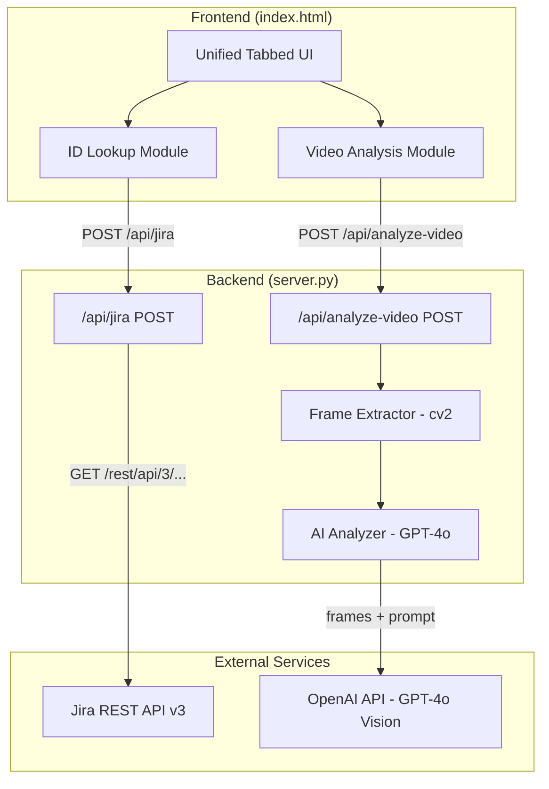
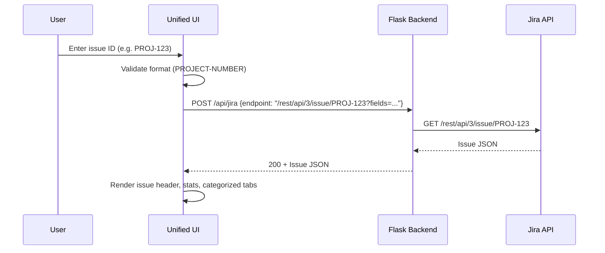
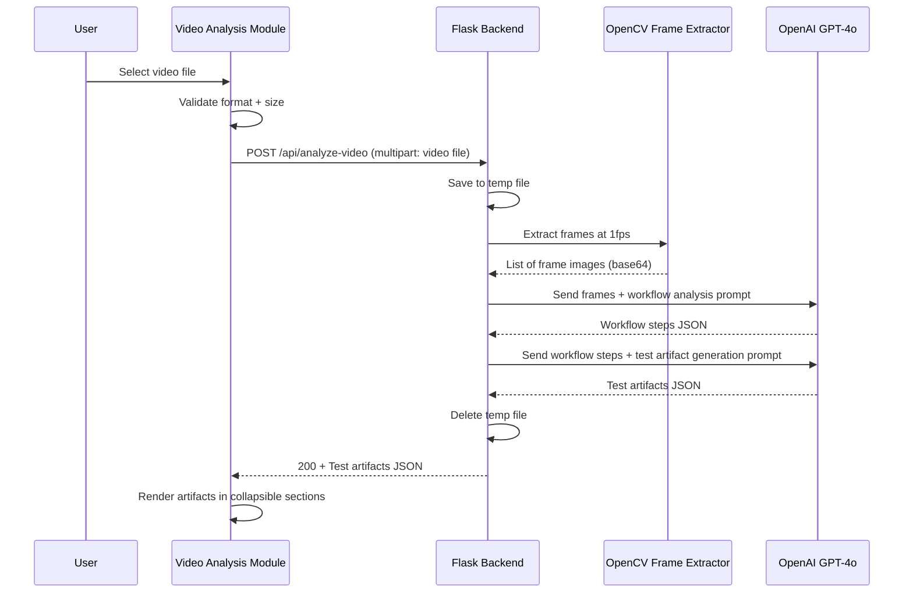

# Design Document: QA Test Case Management

## Overview

The QA Test Case Management feature extends the existing Jira Issue Explorer into a dual-module application. The first module (ID-Based Lookup) leverages the existing Jira API proxy to retrieve and display test case details for a given issue. The second module (Video Analysis) introduces a new backend pipeline that accepts video uploads, extracts frames using OpenCV, sends them to OpenAI's GPT-4o vision API for workflow analysis, and returns structured test artifacts to the frontend.

The architecture follows the existing Flask + single-page HTML pattern. No database is needed — video processing is entirely in-memory/temporary, and results are returned as JSON in the HTTP response. The frontend uses Bootstrap 5 tabs for module navigation and renders test artifacts in collapsible, categorized sections.

## Architecture



## Sequence Diagrams

### ID-Based Lookup Flow



### Video Analysis Flow



## Components and Interfaces

### Component 1: Unified Tabbed UI

**Purpose**: Provides top-level navigation between the ID Lookup and Video Analysis modules within a single page.

**Interface**:
```javascript
// Tab navigation controller
const TabController = {
  activeTab: 'id-lookup',  // 'id-lookup' | 'video-analysis'
  
  switchTab(tabName) {},   // Show target module, hide other, preserve state
  getActiveTab() {},       // Returns current active tab name
  preserveState(tabName) {} // Store module state before switching
}
```

**Responsibilities**:
- Render two primary navigation tabs below the navbar
- Toggle visibility of module content areas
- Preserve user-entered data when switching tabs
- Apply Bootstrap active styling to selected tab

### Component 2: ID Lookup Module

**Purpose**: Accepts a Jira issue ID and displays issue details with categorized related items.

**Interface**:
```javascript
const IDLookupModule = {
  async search(issueKey) {},       // Validate key, fetch from backend, render results
  validateIssueKey(key) {},        // Returns {valid: boolean, error?: string}
  renderIssueHeader(issue) {},     // Display summary, type, status, priority, assignee
  renderCategorizedTabs(data) {},  // Display children, subtasks, tests, linked issues
  showLoading(show) {},            // Toggle loading indicator
  showError(message) {}            // Display error message
}
```

**Responsibilities**:
- Validate issue ID format (`/^[A-Z]+-\d+$/`)
- Send requests to `/api/jira` endpoint
- Render issue header with metadata
- Categorize related items into tabs with count badges
- Handle loading states and errors
- Implement 30-second timeout

### Component 3: Video Analysis Module

**Purpose**: Handles video file selection, upload, and display of generated test artifacts.

**Interface**:
```javascript
const VideoAnalysisModule = {
  validateFile(file) {},           // Returns {valid: boolean, error?: string}
  async uploadVideo(file) {},      // Upload via multipart POST, track progress
  renderArtifacts(artifacts) {},   // Display all categories in collapsible sections
  renderCountSummary(artifacts) {},// Show artifact counts above sections
  showUploadProgress(percent) {},  // Update progress bar
  showProcessingStatus(message) {},// Show analysis-in-progress indicator
  showError(message) {},           // Display error with retry option
  retryUpload() {}                 // Retry last failed upload
}
```

**Responsibilities**:
- File type validation (MP4, WebM, AVI)
- File size validation (1 byte to 100 MB)
- Multipart upload with progress tracking via XMLHttpRequest
- Display processing status during analysis
- Render five artifact categories in collapsible sections
- Handle network errors with retry capability

### Component 4: Flask Backend - Video Endpoint

**Purpose**: Receives video uploads, orchestrates frame extraction and AI analysis, returns test artifacts.

**Interface**:
```python
@app.route('/api/analyze-video', methods=['POST'])
def analyze_video():
    """
    Accepts: multipart/form-data with field "video"
    Returns: JSON with categorized test artifacts
    Status codes: 200, 400, 413, 500, 503
    """
    pass
```

**Responsibilities**:
- Validate presence and format of uploaded file
- Enforce 500 MB file size limit
- Save file to temp directory
- Orchestrate frame extraction and AI analysis
- Clean up temp files after response
- Return structured JSON response

### Component 5: Frame Extractor

**Purpose**: Extracts frames from a video file at a configurable interval using OpenCV.

**Interface**:
```python
def extract_frames(video_path: str, interval_seconds: float = 1.0) -> list[str]:
    """
    Extract frames from video at specified interval.
    
    Args:
        video_path: Path to the video file on disk
        interval_seconds: Time between frame captures (0.5 to 5.0)
    
    Returns:
        List of base64-encoded JPEG frame strings
    
    Raises:
        VideoProcessingError: If video cannot be opened or read
    """
    pass
```

**Responsibilities**:
- Open video file with cv2.VideoCapture
- Calculate frame skip interval from FPS and desired interval
- Extract frames at specified interval
- Encode each frame as base64 JPEG
- Cap total frames to prevent excessive API calls
- Release video capture resources

### Component 6: AI Analyzer

**Purpose**: Sends extracted frames to OpenAI GPT-4o vision API and generates structured test artifacts.

**Interface**:
```python
def analyze_workflow(frames: list[str]) -> dict:
    """
    Analyze video frames to identify workflow steps.
    
    Args:
        frames: List of base64-encoded JPEG frame strings
    
    Returns:
        Dict with 'workflow_steps' list
    
    Raises:
        AIAnalysisError: If API call fails or times out
    """
    pass

def generate_test_artifacts(workflow_steps: list[dict]) -> dict:
    """
    Generate test artifacts from workflow steps.
    
    Args:
        workflow_steps: List of identified workflow step dicts
    
    Returns:
        Dict with keys: test_scenarios, test_cases, negative_cases, 
                        edge_cases, ui_ux_points
    
    Raises:
        AIAnalysisError: If API call fails or times out
    """
    pass
```

**Responsibilities**:
- Construct vision API messages with frames as base64 image URLs
- Send structured prompts for workflow identification
- Parse AI response into workflow steps
- Send follow-up prompt for test artifact generation
- Parse artifacts into categorized structure
- Handle API errors and timeouts (60-second limit)

## Data Models

### Workflow Step

```python
class WorkflowStep:
    step_number: int           # Sequential number
    action_type: str           # text_input | button_click | navigation | system_response | other
    description: str           # Up to 500 characters
    ui_element: str | None     # Visible UI element involved
```

**Validation Rules**:
- `step_number` must be positive integer, max 200
- `action_type` must be one of the defined enum values
- `description` must be non-empty, max 500 characters

### Test Scenario

```python
class TestScenario:
    title: str                     # Scenario title
    workflow_steps: list[str]      # Sequence of step descriptions
    expected_end_state: str        # Expected outcome
```

### Test Case

```python
class TestCase:
    test_case_id: str          # TC-VID-001 format
    title: str                 # Test case title
    preconditions: str         # Setup requirements
    steps: list[str]           # Numbered sequential actions
    expected_result: str       # Expected outcome
    priority: str              # Critical | High | Medium | Low
```

**Validation Rules**:
- `test_case_id` must match pattern `TC-VID-\d{3}`
- `priority` must be one of: Critical, High, Medium, Low
- `steps` must have at least one entry

### Edge Case

```python
class EdgeCase:
    category: str              # boundary_values | empty_inputs | max_lengths | concurrent_ops
    description: str           # Max 500 characters
    expected_behavior: str     # Max 500 characters
```

### UI/UX Validation Point

```python
class UIUXValidationPoint:
    category: str              # alignment | responsive | accessibility | visual_consistency
    label: str                 # Description of what to validate
    status: str | None         # pass | fail | None (unset by default)
```

### API Response Structure

```python
class AnalyzeVideoResponse:
    test_scenarios: list[TestScenario]
    test_cases: list[TestCase]
    negative_cases: list[TestCase]
    edge_cases: list[EdgeCase]
    ui_ux_points: list[UIUXValidationPoint]
    summary: dict              # {scenarios: int, test_cases: int, negative_cases: int, edge_cases: int, ui_ux_points: int}
```

### Error Response

```python
class ErrorResponse:
    error: str                 # Human-readable error message
```

## Error Handling

### Error Scenario 1: Invalid File Upload

**Condition**: User uploads a file with unsupported extension or exceeds size limit
**Response**: Flask returns 400/413 with descriptive error JSON; frontend displays error message
**Recovery**: User can re-select a valid file; retry button available for network failures

### Error Scenario 2: AI API Unavailable

**Condition**: AI_API_KEY not configured or OpenAI API unreachable
**Response**: Flask returns 503 with message indicating video analysis is unavailable
**Recovery**: System administrator must configure AI_API_KEY in environment; user informed of temporary unavailability

### Error Scenario 3: AI Analysis Timeout

**Condition**: OpenAI API does not respond within 60 seconds per call or total processing exceeds 120 seconds
**Response**: Flask terminates processing, cleans up temp file, returns timeout error
**Recovery**: User can retry upload; suggest shorter video if timeout persists

### Error Scenario 4: Video Processing Failure

**Condition**: OpenCV cannot open or read the video file (corrupt, unsupported codec)
**Response**: Flask returns 500 with message indicating video could not be processed
**Recovery**: User uploads a different video file in a supported format

### Error Scenario 5: Jira API Error

**Condition**: Jira returns error (auth failure, issue not found, network timeout)
**Response**: Frontend displays error message from Jira response
**Recovery**: User corrects issue ID or waits for connectivity; existing behavior preserved

### Error Scenario 6: Empty Video Analysis

**Condition**: AI analyzes frames but identifies zero workflow steps
**Response**: Returns empty artifact set with message "No testable workflows detected in the video"
**Recovery**: User uploads a video with clearer workflow demonstration

## Testing Strategy

### Unit Testing Approach

- Test frame extraction with sample video files (short clips)
- Test file validation logic (extension checking, size limits)
- Test AI response parsing (mock OpenAI responses)
- Test test case ID generation (TC-VID-001 sequential pattern)
- Test error handling paths (missing files, bad formats, timeouts)
- Test frontend validation (issue key format, file type/size checks)

### Property-Based Testing Approach

**Property Test Library**: hypothesis (Python)

Property-based tests are appropriate for:
- Test case ID generation (sequential, properly formatted)
- File validation logic (accepts/rejects correct types)
- Workflow step parsing and validation
- Priority assignment rules

### Integration Testing Approach

- End-to-end video upload and response flow (with mocked AI)
- Jira API proxy with mocked Jira responses
- Frontend tab switching and state preservation
- File upload progress tracking
- Temp file cleanup verification

## Performance Considerations

- **Frame extraction**: Cap at ~30 frames maximum to limit API costs and processing time. For a 30-second video at 1fps, this yields 30 frames. For longer videos, increase the interval dynamically.
- **Base64 encoding**: Frames are JPEG-compressed before base64 encoding to reduce payload size to OpenAI.
- **Temp file cleanup**: Files are deleted immediately after processing completes, before the response is sent, to avoid disk accumulation.
- **Upload size limit**: 500 MB server-side limit via Flask configuration (`MAX_CONTENT_LENGTH`). Frontend enforces 100 MB for better UX.
- **AI API timeout**: 60-second timeout per API call prevents indefinite hangs.
- **Total processing timeout**: 120-second cap on entire analysis pipeline.

## Security Considerations

- **File upload safety**: Only accepted extensions processed; temp files stored with random names via `tempfile.mkstemp`
- **API keys**: All credentials stored in environment variables, never in source code
- **File cleanup**: Temp files deleted in a `finally` block to ensure cleanup even on errors
- **Input validation**: Issue ID format validated on frontend and backend; file size checked before processing
- **No persistent storage**: No user data stored on server; everything is request-scoped
- **CORS**: Not needed since frontend is served from same origin

## Dependencies

| Dependency | Purpose | Version |
|---|---|---|
| Flask | Web framework, routing, file uploads | existing |
| requests | HTTP client for Jira API | existing |
| python-dotenv | Environment variable loading | existing |
| opencv-python | Video frame extraction (cv2) | new - add to requirements.txt |
| openai | OpenAI API client for GPT-4o | new - add to requirements.txt |
| Bootstrap 5 | Frontend UI framework | existing (CDN) |
| Bootstrap Icons | Icon set | existing (CDN) |

## Correctness Properties

*A property is a characteristic or behavior that should hold true across all valid executions of a system — essentially, a formal statement about what the system should do. Properties serve as the bridge between human-readable specifications and machine-verifiable correctness guarantees.*

### Property 1: File validation consistency

*For any* file submitted to the upload endpoint, the file is accepted if and only if its extension is in the accepted formats set (mp4, webm, avi, mov, mkv) AND its size is between 1 byte and 500 MB inclusive. Conversely, any file outside these bounds is rejected with the appropriate error status.

**Validates: Requirements 3.2, 3.3, 3.5, 3.6, 7.2, 7.4, 7.5, 7.7**

### Property 2: Test case ID sequential uniqueness

*For any* set of test artifacts generated in a single run, all test case IDs follow the pattern `TC-VID-{NNN}` where NNN is a zero-padded 3-digit integer, IDs are strictly sequential starting at 001, and no two test cases share the same ID.

**Validates: Requirement 5.7**

### Property 3: Temp file cleanup guarantee

*For any* video upload request (successful or failed), the temporary file created on the server is deleted after processing completes, leaving no orphaned files in the temp directory.

**Validates: Requirement 7.3**

### Property 4: Tab state preservation round-trip

*For any* user state in the ID Lookup module (entered text, displayed results) or Video Analysis module (selected file, displayed artifacts), switching to the other tab and back restores the exact prior state.

**Validates: Requirement 1.6**

### Property 5: Priority assignment correctness

*For any* generated test case, the priority field is exactly one of the values {Critical, High, Medium, Low} and no other value.

**Validates: Requirement 5.6**

### Property 6: Workflow step structure and bounds

*For any* analyzed video, the number of extracted workflow steps is between 0 and 200 inclusive, each step has a valid action_type from the defined set, and each step's description does not exceed 500 characters.

**Validates: Requirements 4.3, 4.4**

### Property 7: Non-empty workflow produces all artifact categories

*For any* video analysis that identifies at least one workflow step, the generated output contains non-empty lists for test scenarios, test cases, negative cases, edge cases, and UI/UX validation points.

**Validates: Requirements 5.1, 5.2, 5.3, 5.4, 5.5**

### Property 8: Empty analysis produces empty artifacts

*For any* video that yields zero workflow steps, the returned artifact set contains empty lists for all five categories and includes a descriptive message indicating no testable workflows were detected.

**Validates: Requirement 5.8**

### Property 9: Issue ID validation

*For any* string that does not match the pattern `[A-Z]+-\d+`, the ID Lookup module rejects the input without sending a request; for any whitespace-only string, the module similarly prevents submission.

**Validates: Requirements 2.6, 2.7**

### Property 10: Error response structure

*For any* error condition (missing file, invalid format, oversized file, AI timeout, missing config), the response body is valid JSON containing an "error" key with a non-empty string value, and the HTTP status code is appropriate (400, 413, 500, 503).

**Validates: Requirements 7.4, 7.5, 7.7, 8.6, 8.7**

### Property 11: Artifact count summary accuracy

*For any* generated test artifact response, the count summary displays numeric values that exactly match the actual number of items in each of the five categories (test scenarios, test cases, negative cases, edge cases, UI/UX points).

**Validates: Requirement 6.7**
